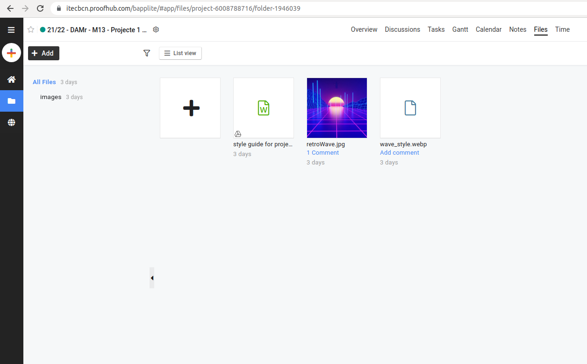
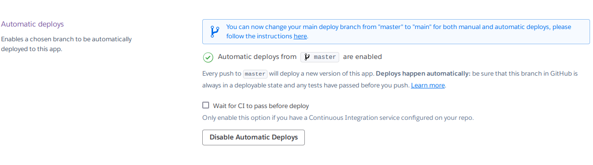
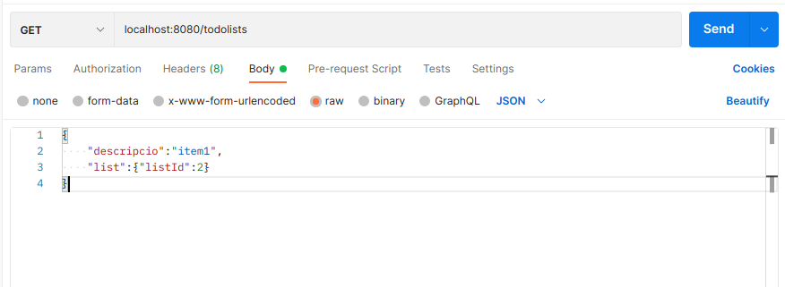
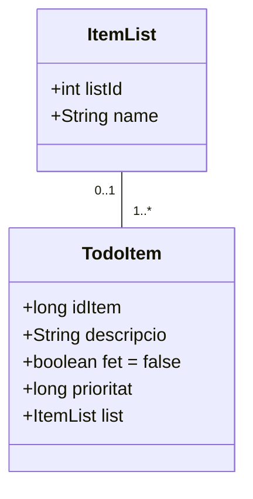

# Minima List


## Resumen

Minima List es un proyecto *full stack* con el objetivo de hacer una lista de tareas.
Hemos implementado la metodología *scrum* para la gestion del proyecto.
Este documento permite ver todo el proceso de desarrollo, las historias de usuario, *sprints*, *backlog* y capturas de pantalla.

## Desarrolladores

- Alejandro Navarro
- Jonathan Navarro
- José Zaquinaula

## Historias de Usuario

Como usuario web no registrado:
- Añadir tareas a la lista: quiero ver una lista de mis tareas.
- Actualizar tareas: quiero modificar las tareas existentes y que se vean centradas.
- Marcar / desmarcar tareas: quiero poder marcar y desmarcar las tareas como "hecho" y "por hacer" (por defecto) respectivamente.

## Sprints

### Sprint 1

1. Para empezar pusimos a punto un repositorio de Git compartido.

2. Hemos acordado en un almacenamiento de datos común para todo el equipo, como se ve a continuación.

3. Después, nos hemos informado sobre otras aplicaciones en internet para inspirarnos.
4. Entonces, una vez pensado el nombre de nuestra empresa, diseñamos la primera versión del logo para el producto y su nombre.
5. Hemos escrito el *readme* y la *[style guide](https://itecbcn.proofhub.com/go?rpEkAwb)*.
6. Alojamos la página web en Gitlab.
7. Rellenamos datos de prueba para probar la página web en funcionamiento.
8. Finalmente, hemos publicado la [página web](https://josezaq.gitlab.io/m13-proyecto-to-do-list/).


### Sprint 2

1. Primero creamos un proyecto nuevo de GitLab para instalar Spring Boot.
2. Entonces instalamos Spring Boot en nuestro proyecto con las dependencias: Lombok, Spring Web, Thymeleaf, Spring Data JPA y H2.
3. Una vez preparado el proyecto, hemos configurado los controladores y modelos.
4. Nos hemos registrado en Postman y clonado el repositorio en GitHub.
5. También nos hemos registrado en Heroku y sincronizado el repositorio de GitHub con uno nuevo creado previamente en Heroku, activando el control de versiones automático en la branca "main".

6. Programamos los controladores para crear, actualizar y borrar elementos de la lista.
7. Y finalmente, utilizando el objeto *ResponseEntity*, programamos que los métodos devuelvan *HttpStatus* para comunicar al cliente si ha habido algun error en la petición:
    - Error *404 not found* si el objeto de la petición no existe.
    - Error *204 no content* si el objeto de la petición no tiene contenido.
    - Estado *200 OK* si el objeto de la petición devuelve el JSON correctamente.

### Sprint 2 - End points

- GET "/todoitems" muestra todos los elementos actuales.
- GET "/todoitems/{id}" muestra el elemento el cual su ID es el indicado en el *endpoint*.
- POST "/todoitems" inserta un elemento nuevo, como mínimo necesita el atributo "descripcio":

```
{
  "descripcio": "value",
  "fet": false,
  "prioritat": 10
}
```

- PUT "/todoitems" modifica un elemento existente, necesita el atributo "idItem", enviando un JSON con el formato que se muestra a continuación:

```
{
  "idItem": 1,
  "descripcio": "some data here",
  "fet": true,
  "prioritat": 123
}
```

- DELETE "/todoitems/{id}" elimina el elemento el cual su ID es el indicado en el *endpoint*.

###  Sprint 3

- Crear Lista:


## Modelo de Datos

Si no se muestra el modelo de datos, (en IntelliJ IDE) ir a settings > language > markdown y activar mermaid.

