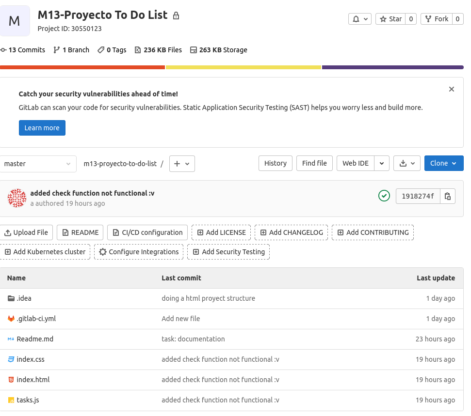
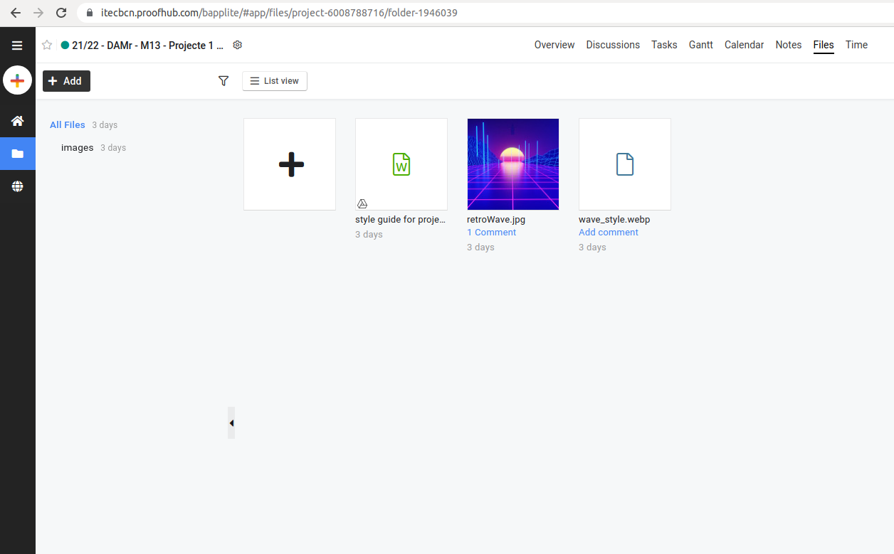
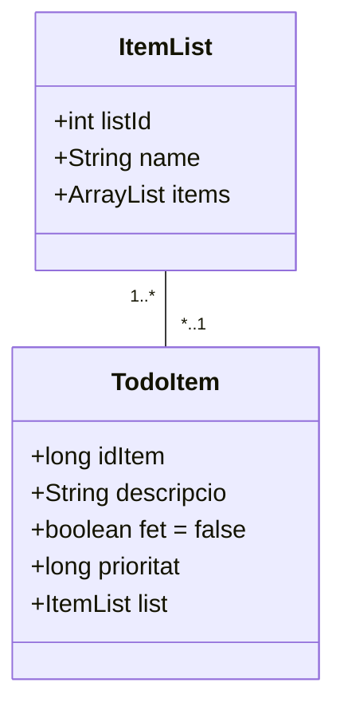
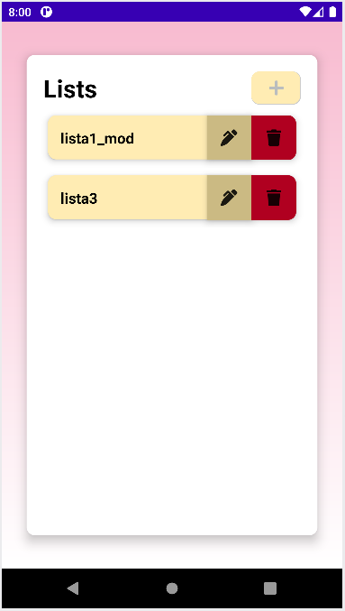
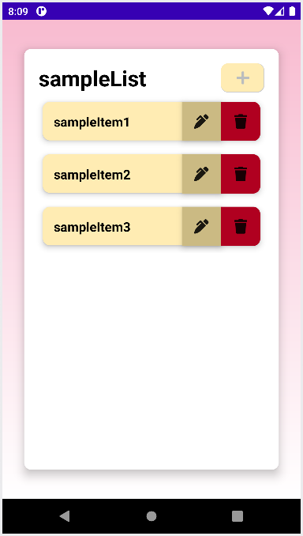

# Minima List


## Resumen

Minima List es un proyecto *full stack* con el objetivo de hacer una lista de tareas.
Hemos implementado la metodología *scrum* para la gestion del proyecto.
Este documento permite ver todo el proceso de desarrollo, las historias de usuario, *sprints*, *backlog* y capturas de pantalla.

## Desarrolladores

- Alejandro Navarro
- Jonathan Navarro
- José Zaquinaula

## Historias de Usuario

Como usuario web no registrado:
- Añadir tareas a la lista: quiero ver una lista de mis tareas.
- Actualizar tareas: quiero modificar las tareas existentes y que se vean centradas.
- Marcar / desmarcar tareas: quiero poder marcar y desmarcar las tareas como "hecho" y "por hacer" (por defecto) respectivamente.

## Sprints

## Sprint 1

1. Para empezar pusimos a punto un repositorio de Git compartido.

2. Hemos acordado en un almacenamiento de datos común para todo el equipo, como se ve a continuación.

3. Después, nos hemos informado sobre otras aplicaciones en internet para inspirarnos.
4. Entonces, una vez pensado el nombre de nuestra empresa, diseñamos la primera versión del logo para el producto y su nombre.
5. Hemos escrito el *readme* y la *[style guide](https://itecbcn.proofhub.com/go?rpEkAwb)*.
6. Alojamos la página web en Gitlab.
7. Rellenamos datos de prueba para probar la página web en funcionamiento.
8. Finalmente, hemos publicado la [página web](https://josezaq.gitlab.io/m13-proyecto-to-do-list/).


## Sprint 2

1. Primero creamos un proyecto nuevo de GitLab para instalar Spring Boot.
2. Entonces instalamos Spring Boot en nuestro proyecto con las dependencias: Lombok, Spring Web, Thymeleaf, Spring Data JPA y H2.
3. Una vez preparado el proyecto, hemos configurado los controladores y modelos.
4. Nos hemos registrado en Postman y clonado el repositorio en GitHub.
5. También nos hemos registrado en Heroku y sincronizado el repositorio de GitHub con uno nuevo creado previamente en Heroku, activando el control de versiones automático en la branca "main".

6. Programamos los controladores para crear, actualizar y borrar elementos de la lista.
7. Y finalmente, utilizando el objeto *ResponseEntity*, programamos que los métodos devuelvan *HttpStatus* para comunicar al cliente si ha habido algun error en la petición:
    - Error *404 not found* si el objeto de la petición no existe.
    - Error *204 no content* si el objeto de la petición no tiene contenido.
    - Estado *200 OK* si el objeto de la petición devuelve el JSON correctamente.

### End points

- GET "/todoitems" muestra todos los elementos actuales.
- GET "/todoitems/{id}" muestra el elemento el cual su ID es el indicado en el *endpoint*.
- POST "/todoitems" inserta un elemento nuevo, como mínimo necesita el atributo "descripcio":

```
{
  "descripcio": "value",
  "fet": false,
  "prioritat": 10
}
```

- PUT "/todoitems" modifica un elemento existente, necesita el atributo "idItem", enviando un JSON con el formato que se muestra a continuación:

```
{
  "idItem": 1,
  "descripcio": "some data here",
  "fet": true,
  "prioritat": 123
}
```

- DELETE "/todoitems/{id}" elimina el elemento el cual su ID es el indicado en el *endpoint*.

### Modelo de Datos



## Sprint 3

En el tercer *sprint*, hemos preparado la web para que pueda gestionar más de una lista y las tareas de cada una de ellas.

Para poder hacerlo, hemos adaptado el entorno HTML, programado los *end points* y preprogramado el javascript.

### Entorno HTML

Tenemos un único index.html en el cual insertamos las listas dentro de un "div" en "main".

Ahora tenemos un "div" para listas y otro "div" para tareas, uno al lado del otro. El ejemplo a continuación, esta simplificado.

```
<main>

<header>Lists</header>
<div class="list-insert">
    <input type="text" id="list" placeholder="Add a list..." maxlength="45">
    <button id="addListBtn" onclick="addList()">
        
    </button>
</div>

<header>Tasks</header>
<div class="task-insert">
    <input type="text" id="task" placeholder="Add a task..." maxlength="45">
    <button id="addBtn" onclick="addTask()">
        
    </button>
</div>

</main>
```

### Javascript

En javascript tenemos tres archivos, "lists.js" encargado de gestionar la adición de listas, "tasks.js" gestiona la adición de tareas y "apiConnection.js" gestiona los métodos que realizan peticiones a la API.

A continuación se muestra un método que realiza una petición GET a la API para devolver las tareas de una lista determinada. Devuelve una ``Promise<Response>`` que puede ser satisfactoria o no, la respuesta se gestiona diferente en cada caso.

```
const url = "https://todo-list-springboot.herokuapp.com";
const getItems = "/todoitems";
const getLists = "/todolists";

function fetchListTasks( listId )
{
    return fetch( url + getLists + "/" + listId + getItems,
        {
            method : "GET",
            headers : new Headers({ "Content-type" : "application/json" } )
        } );
}
```

### End points

API URL: https://todo-list-springboot.herokuapp.com

#### List endpoints

- POST "/todolists" (requiere enviar una lista): crea una lista nueva.


- GET "/todolists": muestra todas las listas.
- GET "/todolists/{id}": muestra la lista cuyo id corresponde con el parámetro {id}.


- PUT "/todolists" (requiere enviar una lista): actualiza una lista existente.


- DELETE "/todolists/{id}": elimina la lista cuyo id corresponde con el parámetro {id}.


#### Task endpoints

- POST "/todolists/{id}/todoitems" (requiere enviar una tarea): crea una tarea nueva en la lista cuyo id corresponde con el parámetro {id}.


- GET "/todoitems": muestra todas las tareas.
- GET "/todoitems/{id}": muestra la tarea cuyo id corresponde con el parámetro {id}.
- GET "/todolists/{id}/todoitems": muestra todas las tareas de una lista cuyo id corresponde con el parámetro {id}.


- PUT "/todoitems" (requiere enviar una tarea): actualiza una tarea existente.


- DELETE "/todoitems/{id}": elimina la tarea cuyo id corresponde con el parámetro {id}.

## Sprint 4

En este *sprint* hemos desarrollado una aplicación android que gestiona listas y tareas.

La aplicación Minima List permite crear y actualizar listas como gestionar las tareas de cada una de ellas.






## Sprint 5

En el *sprint* 4, aprovechamos la API alojada en Heroku para gestionar las listas y las tareas de cada, pero desde una aplicación android.

1. Hemos creado una clase "service.ApiInterface" que redirige los métodos de kotlin como peticiones HTML a nuestra API.
```
interface ApiInterface
{
    companion object
    {
        private var BASE_URL = "https://todo-list-springboot.herokuapp.com"

        fun create() : ApiInterface
        {
            val client = OkHttpClient.Builder().build()

            val retrofit = Retrofit.Builder()
                .baseUrl( BASE_URL )
                .addConverterFactory( GsonConverterFactory.create() )
                .client(client)
                .build()

            return retrofit.create( ApiInterface::class.java )
        }
    }
}
```
2. En la misma clase, creamos un método kotlin por cada petición HTML que necesitamos.
```
// Adds a new item to a specific list

@POST( "/todolists/{id}/todoitems" )
fun addApiItem( @Path( "id" ) id : Int, @Body todoItem : TodoItem ) : Call<TodoItem>
```
3. En el *ViewModel* reprogramamos los métodos que gestionan las listas y sus tareas para que utilicen las peticiones de la clase "ApiInterface".
```
// (POST) Adds an item to a specific list

fun addTask( todoItem : TodoItem, adapter : RecyclerView.Adapter<RecyclerView.ViewHolder>? )
{
    val request = api.addApiItem( todoItem.list.listId, todoItem )

    request.enqueue( object : Callback<TodoItem>
    {
        override fun onFailure( call : Call<TodoItem>, throwable : Throwable )
        {
            Log.e( "ERROR", throwable.message.toString() )
        }

        override fun onResponse( call : Call<TodoItem>, response : Response<TodoItem> )
        {
            if ( response.isSuccessful )
            {
                val task = response.body()

                if ( task != null ) getListById( todoItem.list.listId )?.items?.add( task )

                adapter?.notifyDataSetChanged()
            }
        }
    })
}
```

## Sprint 6

En el último *sprint* hemos recuperado el tiempo perdido, aprovechando para arreglar funcionalidades que quedaron sin terminar en las versiones anteriores y posibles errores que han aparecido por cambiar cosas.

### Errores en la web

Hemos solucionado los siguientes problemas encontrados en la funcionalidad de la web:

1. Las listas se pueden crear y eliminar localmente pero no hacía petición HTML, ahora hace peticiones HTML para persistir los cambios de crear y eliminar listas.
2. El nombre de las listas no se podía modificar, hemos añadido un icono interactivo en cada lista para permitir al usuario cambiar el nombre de una lista existente. Hace petición HTML para que el cambio persista.
3. Hemos modificado el título de las tareas para que muestre la lista actual seleccionada, para que el usuario sepa fácilmente que lista está visualizando.
4. Al crear una lista, los identificadores unicos de cada lista se mezclaban localmente. Entonces al crear una tarea de la lista seleccionada, se creaba la tarea en otra lista. Ahora los identificadores no se mezclan y se pueden crear tareas inmediatamente después de crear una lista sin necesidad de actualizar la página.
5. El aspecto del icono para modificar listas a sido desplazado y redimensionado ya que era muy pequeño.

### Cambios en la API

Hemos hecho un par de cambios en la API que tenemos alojada en Github:

1. Hemos repasado el código de la API para hacerlo más eficiente, eliminando código repetido.
2. También hemos eliminado registros de la base de datos, que correspondian con tareas sin ninguna lista asignada.

### Mejoras en la aplicación de android

Por último, hemos añadido mejoras a la aplicación android:

1. El diseño visual de la aplicación ahora es *responsive*, para ello hemos modificado las medidas fijas de los márgenes de cada elemento por medidas dinámicas que se adaptan a la pantalla.
2. Ahora la página se puede recargar deslizando el dedo hacia abajo desde la parte superior de la pantalla.
3. Hemos añadido animaciones para las transiciones entre el fragmento de listas y tareas. Ahora la pantalla se mueve hacia la izquierda haciendo *swipe left* cuando se accede al fragmento de tareas y *swipe right* cuando se vuelve al fragmento de listas.